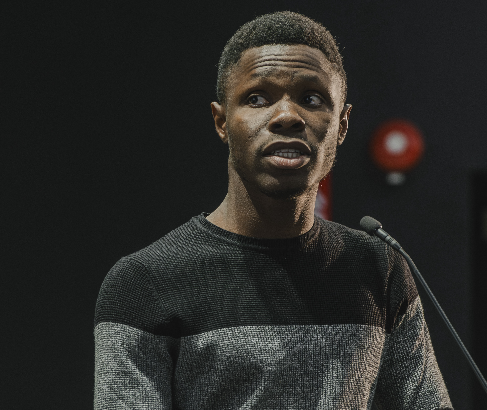

# Rufai Omowunmi Balogun

## Education
- **B.Tech**, Meteorology and Climate Science, Federal University of Technology, Akure (FUTA), Nigeria

- **M.Sc**, Earth Observation and GeoInformatics, University of Salzburg, Salzburg, Austria,

- **M.Sc.**, GeoData Science, University of South Brittany, Vannes, France

## Research Interests
- Earth Observation
- Machine Learning
- Hydrometeorological Hazards
